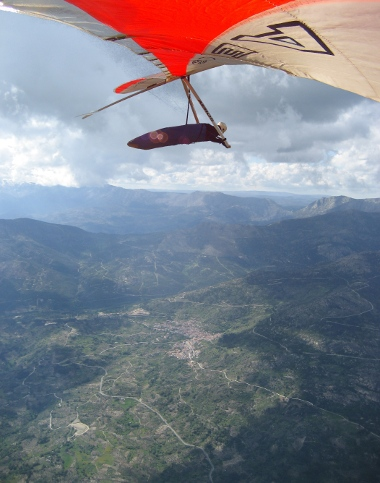

## Reglamento y notas

En [este enlace](downloads/Reglamento_I_Open_de_Ala_Delta_de_Pedro_Bernardo.pdf "Reglamento del Open de Pedro Bernardo en formato PDF") tenéis a vuestra disposición el [Reglamento del I Open de Pedro Bernardo de Ala Delta](downloads/Reglamento_I_Open_de_Ala_Delta_de_Pedro_Bernardo.pdf "Reglamento del Open de Pedro Bernardo en formato PDF"). Como resumen introductorio extraemos del mismo las siguientes notas:

* Habrá una **cena inaugural** el Sábado día 28, y una **entrega de premios** el martes día 1 **con comida y bebida** a discreción.
* **Los tres mejores** clasificados **en cada categoría recibirán un trofeo** acompañado de algún regalito de la zona.
* **La responsabilidad y la seguridad de cada piloto corre a cargo del mismo** (cómo cuando vamos a volar normalmente). Para participar será **imprescindible** presentar el correspondiente **seguro de responsabilidad civil** que cubra la actividad de vuelo libre en ala delta.
* **El transporte de alas y la recogida corresponde a los propios participantes**; si necesitáis conductores, desde la organización os los podemos proporcionar con un precio razonable por sus servicios (ver información de contacto en el [Reglamento](downloads/Reglamento_I_Open_de_Ala_Delta_de_Pedro_Bernardo.pdf "Reglamento del Open de Pedro Bernardo en formato PDF")).
* Para cualquier duda o sugerencia podéis utilizar el correo electrónico del foro que hemos habilidado para la prueba [opendeltietar@googlegroups.com](https://groups.google.com/group/opendeltietar?hl=es).
* Si todo esto te suena bien y te apetece participar mándanos tus datos por medio del [formulario de inscripción](inscripcion.html).
